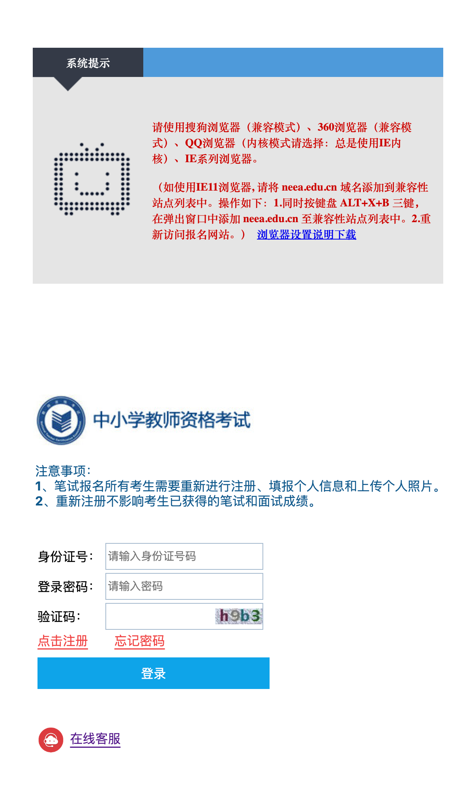

# 2022年下半年广东中小学教师资格考试网上报名跳过IE浏览器校验

## 1. 跳过IE浏览器校验直接访问注册页面

[广东省注册页面](https://ntcebm5.neea.edu.cn/apply/memapp/memReg)，其他省份，把 ntcebm5 修改为对应省份的地址

第一次注册完会自动跳转到信息填写页面

## 2.1 第二次进入报名信息页面

打开[首页](https://ntcebm5.neea.edu.cn/apply)，这时候会跳到强制使用 IE 浏览器的提示 (https://ntcebm5.neea.edu.cn/apply/memapp/ieNote)，打开控制台，网络选择 slow 3G，控制台输入代码，按一下回车，方便等下使用 ↑ 方向键快速输入

```
window.ActiveXObject =  {}
```

修改URL 为 https://ntcebm5.neea.edu.cn/apply，按回车，这时候页面加载很慢，在控制按一下 ↑ ，出现刚刚准备好的代码，一直按回车。

然后见证奇迹的时刻到了

可以成功看到登录页面，输入信息登录就可以成功进入报名信息页面


排版乱了，但是没有关系，功能正常使用

## 2.2 在 ieNote 页面插入登录表单

复制 `plugin.js` 代码在控制台执行，可以正常登录跳转到信息页面

